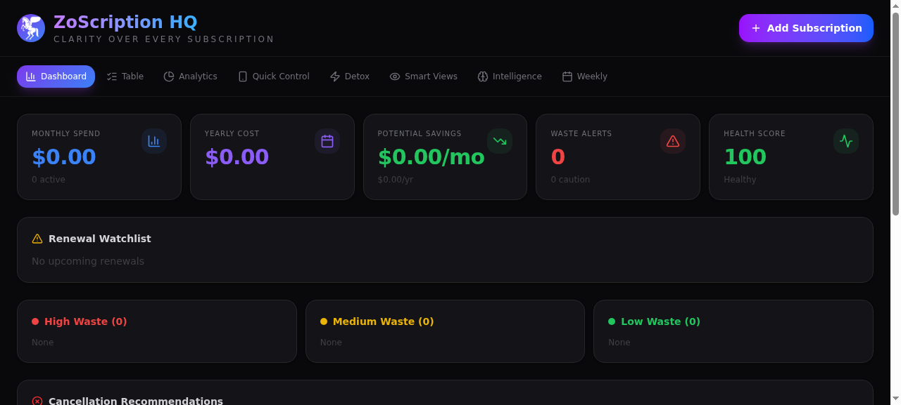

# ZoScription HQ — Subscription Tracker for Zo Space

A full-featured subscription management dashboard that runs on your Zo Computer. Track, analyze, and optimize every subscription with waste scoring, value analysis, detox mode, and savings scenarios.



## Quick Install

Ask Zo:

```
Install ZoScription — create a page route at /zoscription using the code from Skills/zoscription/routes/page-zoscription.tsx. Make it public.
```

## Manual Install

1. In your Zo Space, create a new **page route** at `/zoscription`
2. Paste the contents of `routes/page-zoscription.tsx` as the code
3. Upload a logo image as `/images/pegasus.png` in Space assets (optional)
4. Visit `https://yourhandle.zo.space/zoscription`

## Features

- **8 tabs**: Dashboard, Table, Analytics, Quick Control, Detox, Smart Views, Intelligence, Weekly
- **Waste scoring**: Identifies subscriptions draining your wallet
- **Value analysis**: Rates each subscription's worth (Excellent → Weak)
- **Savings scenarios**: See impact of 10%, 25%, 50% cuts
- **Detox mode**: Find your minimum viable subscription set
- **Dark/Light mode**: Toggle themes with localStorage persistence
- **Mobile-friendly**: Quick Control tab designed for phone use

## Privacy & Data Isolation

- ✅ **100% client-side** — All data stored in your browser's localStorage
- ✅ **Zero server calls** — No APIs, no database, no files on disk
- ✅ **No cross-contamination** — Each user's data is completely isolated
- ✅ **No API keys required** — Works immediately after install
- ✅ **No personal data in this repo** — Clean install = empty board

## Built by

**DaGreatGAWDNYC** · Built with **Zo Computer** · ⢕⣿⢀⣏⣿⢳⡕⣆⢺⣋⢟
